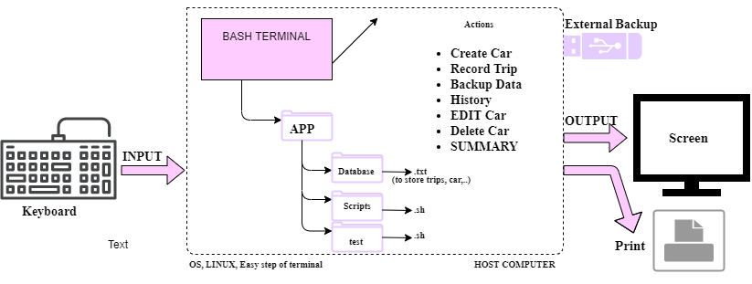
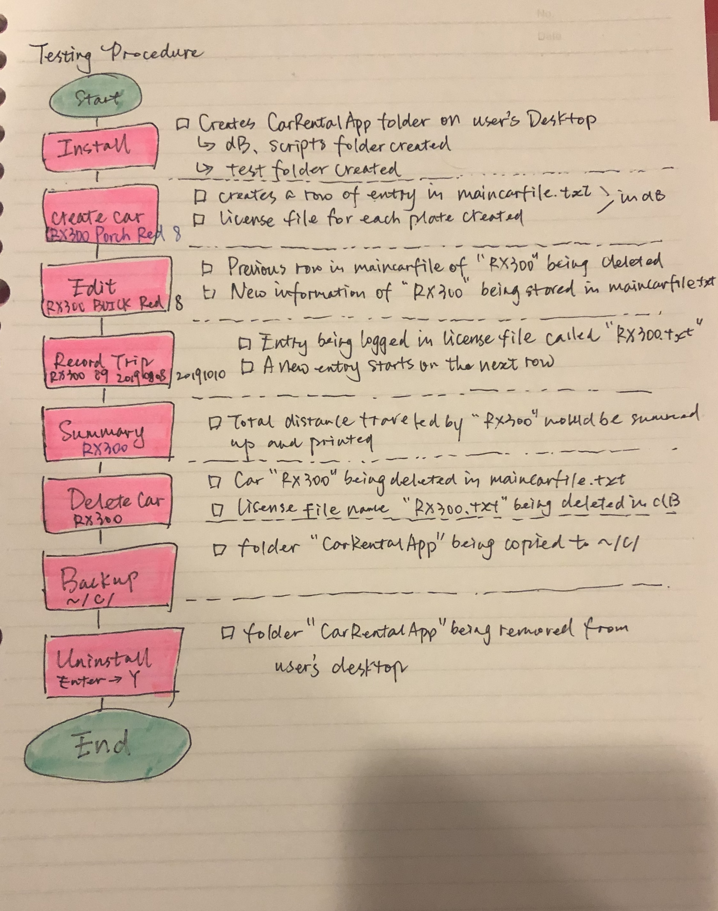

Car Rental Minimal App
===========================

A car rental management minimal app in Bash.

Contents
-----
  1. [Planning](#planning)
  1. [Design](#design)
  1. [Development](#development)
  1. [Evalution](#evaluation)

Planning
----------
**Defining the problem (Tpoic 1.1.1)** 

A computer program for purpose of recording information about their orders is needed by a car rental office. The company is specifically interested in building a program to collect basic information about the distance driven for each car. Stakeholders in this process include hardware, software, people working with it or using it and the immediate environment. In this case specially, the problem accompanies with client reqiurements including a simple terminal based program; a simple and transparent installation, etc. 

**Solution proposed**

In order to meet clients' expectation of an easy, terminal-based system that enables the company a sufficient and effective way of better recording the data of their orders, I chose BASH as the language to code the project. Considering that these data are transferred from a manual record to a local system, I added functionalities such as backup and summary to complete the project and better meet users' needs.

- Github

All scripts and documentation are stored in Github, making it easy to contribute to this open source projects, provide a clear documentation for the users, and showcase the project to our clients.

- BASH

BASH is the language I used to code the project. Advantages of using Bash is that it can run most sh scripts without modification. Like the other GNU projects, the bash initiative was started to preserve, protect and promote the freedom to use, study, copy, modify and redistribute software, which perfectly falls in our clients' expectation on the project.

**Success criteria**

Expected measureable outcomes by the client includes:
1. A car can be created and stored in the database
1. A car information can be edited
1. A car can be deleted from the database
1. The installation is ***simple-> one step process*
1. A summary (total/average distance traveled) can be generated for a particular car
1. Trips can be recorded and stored for an existing car
1. A simple, accessible database
1. A backup system is considered during the process of designing


Design
---------
### First sketch of the system diagram


**Fig.1** This is a first sketch of the system considering three factors: input, processing, and output.



**Fig.2** Final skectch: folder test added.

### Test Plan
 

**Fig.3** This is the flow diagram to test the functionality within the process of CarRental project.

Correction: install - Install does not create the test folder. Test is for the developer.

### Flowchart for each steps


Development
--------

### Install
The following steps summarize the algorithm to install RentalCarApp on user's desktop.
1. Send a message to the user about where the app is being installed in.
2. Move to the desired location.
3. Create App folder
4. Create folder for datebase and scripts.
```sh
#!/bin/bash
#This program installs the application under a default path
#to the user's desktop for Windows user
#also creates folder structure for CarRental App

echo "starting the installation"
echo "This app will be installed on desktop. Press enter."
read

# moving to the desired location
cd ~/Desktop
echo "moving to" ~/Desktop
echo $PWD

#Create App folder
mkdir RentalCarApp
cd RentalCarApp

#create folder for database and scripts
mkdir dB

echo "structure created successfully"
cp -r ~/desktop/CarApp/scripts/ ~/desktop/RentalCarApp/scripts/
```

- Problems and solution

**_fixed_** While the first attempt was to allow the user to enter any location they woould want the app to be at, it is easier to create a default installation of having the app installed on the desktop.

**_fixed_** The first version of install only creates the empty folder while now it includes scripts and all files the user need.

### Development of the function: Create a new car.
The following steps summarize the algorithm to create a new car in the system.
1. get inputs (Plate, Model, Color, Passenger number)
2. Check number of arguments. If 4 then continue, if not exit message.
3. Write it to the main file with on eextra line. Not erasing other entries.
4. Create car trip file with license plate.txt.

```sh
#!/bin/bash
#This script creates cars into maincarfile.txt
#Sep.30th

if [ $# -ne "4" ];
then
  echo "Wrong input. Please re-enter with Plate, Model, Colour, and Passengers"
  exit
fi

#Number of arguments is correct. Continue
plate=$1
model=$2
colour=$3
pp=$4

#adding new entry to file maincarfile.txt
echo " $plate $model $colour $pp" >> ~/Desktop/RentalCarApp/dB/maincarfile.txt
cd ../dB
echo "" > $plate.txt
cd ../scripts
bash frame "Car created successfully"
```

- Problems and solution

**_fixed_** How to add new car information without deleting the previous ones ---> by using >> instead of >

### Development of the function: Record a new car.
The following steps summarize the algorithm to record a new car in the system.
1. Check arguments (Plate, km, Dateout, Datein)
2. Check that the car exists 
```sh
if test[-f "$file"]; 
	then
```
3. If the car exists , then write the trip info in the $plate.txt file, without erasing previous trips.
```sh
#/!bin/bash
#This program is created to record new trips for each car in record
#Sep.30th

if [ $# -ne "4" ];
then
  echo "Wrong input. Please re-enter with Plate, KM, Dateout, and Datein"
  exit
fi

#Number of arguments is correct. Continue.
plate=$1
KM=$2
Dateout=$3
Datein=$4

#Check if the car exists
cd ../dB
file="$plate.txt"
if [ -f "$file" ];
  then echo " $KM $Dateout $Datein" >> $plate.txt
  cd ../scripts
  bash frame "Updated successfully"
else
  echo "No car exists, please enter the car info first"
fi
```

- Problems and solution

**_fixed_** The original version of this script records the license plate in the individual car file each time. After creating the syntax summary, I changed it into only input the other three arguments so it is easier to calculte the total distance.

### Development of the function: Edit a car.
The following steps summarize the algorithm to edit a car in the system.
1. Ask the user to input a license plate and check if the car exits in maincarfile.txt
2. Locate the line with the given car plate and delete it
3. Add new information about the car.
```sh
#!/bin/bash
#This program edit the information of an exiting car in the
#maincarfile
#user enters [license plate] [model] [color] [pp]

if [ $# -ne 4 ]; then
  echo "Error with the number of arguments"
  echo "Enter License Maker Model Passengers"
  exit
fi

license=$1
model=$2
color=$3
pp=$4

cd ../dB

if [ ! -f "$license.txt" ]; then
  echo "File not found!"
fi

#find the line with the given car plate and delete it
sed -i "/$license/d" maincarfile.txt
#add the new information
echo "$license $model $color $pp" >> maincarfile.txt
cd ../scripts
bash frame "Car edited successfully"
```

- Problems and solution

**_fixed_** Originally my idea was to locate the license plate and by using sed -i to replace the row with the new input. However, the code didn't work well, so by splitting it into two steps of deleting and adding new information the problem is solved.

### Development of the function: Delete a car.
The following steps summarize the algorithm to delete a car in the system.
1. Get the input from the user
2. Check the number of arguments
3. Check if the file exists
4. If so, remove the car from maincarfile.txt
5. Remove the license plate file of the car.
```sh
#!/bin/bash
cd ../dB
if [ $# -eq 1 ]; then
  if [ -f "$1.txt" ]; then
    rm "$1".txt
    echo "`sed  /$1/d  maincarfile.txt`" > maincarfile.txt
    bash ../scripts/frame "File deleted successfully"
  else echo "File does not exist"
  fi
else echo "wrong argument"
fi
```

- Problems and solution

**_fixed_** How to check if a car exists in the maincarfile is by using the argument -f

### Development of the function: Summary of distance
The following steps summarize the algorithm to summarize the total distance a car has traveled.
1. Check the number of arguments user input
2. Check if the car exists
3. Adding up the kilometers (first string in each row)
4. Output the total distance to the user
```sh
#!/bin/bash
# This script check the summary of a particular car

cd ../dB

s=0
# checks number of arguments
if [ $# -ne 1 ]; then
  echo "Enter a license plate"
  exit
fi

# checks if a car exist
 if [ ! -f ~/Desktop/RentalCarApp/dB/$1.txt ]; then
   echo " File doesn't exist"
    exit
  fi
# adding the kilometers
#How you read a file
  while read line
      do
         for i in $line
         do
               ((s=s+i))
                break
        done
        # <means that you are reading from that file
      done < $1.txt

    cd ../scripts
    bash frame "Total distance of $1: $s km"
```

- Problems and solution

**_fixed_** How to read a file and do an addtion of the argument in each row.

Solution:
```sh
#How you read a file
  while read line
      do
         for i in $line
         do
               ((s=s+i))
                break
        done
        # <means that you are reading from that file
      done < $1.txt
```

### Development of the function: Data Backup
The following steps summarize the algorithm to backup the app in a desired location.
1. Get input: user's desired location to install the app.
2. Check the number of arguments
3. Copy the folder to the desired location

```sh
#!/bin/#!/usr/bin/env bash

#This script backups teh eternity of the RentalCarApp

location=$1
#if the number of the arguments does not equate to 1
if [ $# -ne 1 ];
then echo "sorry, wrong path"
else
  cp -a ~/Desktop/RentalCarApp/ $1
  cd ../scripts
  bash frame "Succeeded"
fi
```

- Problems and solution

**_fixed_** Whenever I use the command cd to go to the desired location, the system always report back with too much arguments. Instead, I tried to get the location from the users and copy the folder directly.

### Uninstall
The following steps summarize the algorithm to uninstall the app.
1. Send out a message asking whether the user wants to uninstall the app.
2. Move to desktop and remove the app folder
3. Send out another message
4. Exit

```sh
#!/bin/bash
#This program is to remove the app under the default path on Windows system

#Send out a meesage
echo "Are you sure you want to uninstall RentalCarApp?(Enter Y or N)"
read answer

  if [ $answer = "Y" ];
  then
    cd ~/Desktop
    rm -R RentalCarApp
    echo "Thank you for using RentalCarApp"
  elif [[ $answer = "N" ]];
  then
    echo "Exiting"
    Exit
  else
    Exit
  fi
```

- Problems and solution

**_fixed_** I realized that there should be a clear message being sent out to the user confirming if they are uninstalling and the app so I reconstructed my code and added two message to the file.

### Help(Man) Page
Given the fact that there is no man page on windows system, I decided to instead create an online support page(.md) in this repository under the folder "Help". 

[Click here to access the help folder](https://github.com/comsci-uwc-isak/unit-1-project-LingyeWU/tree/master/Help)

### Test program


Evaluation
-----------

### Evaluation of the project

| Criteria of evaluation | IF MET | Comments |
| --- | --- | --- |
| A car can be created and stored in the database | YES | maincarfile.txt & license plate file |
| A car information can be edited | YES | ***only inside maincarfile*** |
| A car can be deleted from the database | YES | 
The installation is ***simple-> one step process*** | YES | Re-arranged files in to folder CarApp 
A summary (total/average distance traveled) can be generated for a particular car | YES | ***only total distance***
Trips can be recorded and stored for an existing car | YES | 
A simple, accessible database | YES | Date can be easily restored and copied; a fully-developed backup system
A backup system is considered during the process of designing | YES | 


### Improvements for future

#### Minor improvements
1. Install and uninstall: Allow the users to enter the location wherever they want the app to be and in uninstall automatically goes to the location.

1. Backup:  Let the program have an online database, so in case when all the data from PC will be removed, the program data will have a backup, that won’t be affected by any kind of malicious programs or viruses.

1. Edit: Create a script to edit trip information as well.

1. Summary: Create a summary2.sh for client to calculate its average travel distance per day

#### Major improvements
1. Create an interface for the project, making the precedure more visual.

1. Add a functuality to the project: Calculate. This syntax should enable the client to calculate the money of each car rent.


